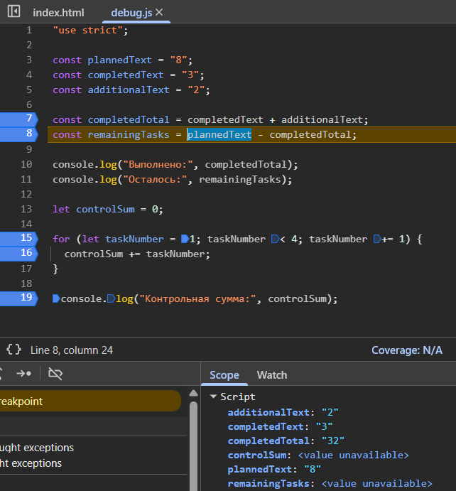
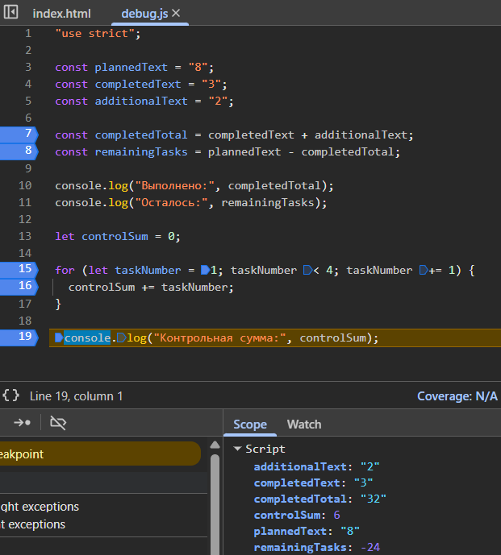
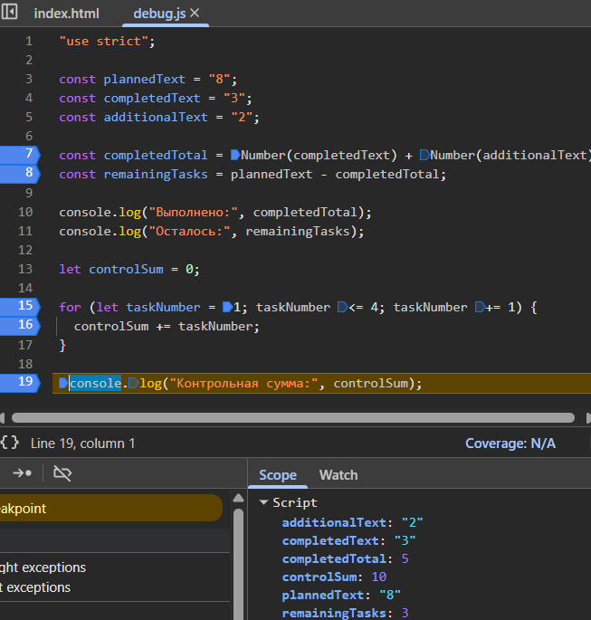

# Отчёт по практической работе № 1

Данный файл является отчётом и инструкцией запуска других файлов в данном репозитории.
Папка `screenshots` предназначена для иллюстрации отладки.

## 1. Автор

- **Студент:** Севрюков Егор Петрович
- **Группа:** ЭФБО-13-25  
- **Вариант:** ((25 - 1) % 8) + 1 = 4

## 2. Инструменты и предварительная подготовка

в данной практической работе использовалась следующая версия установленного исправления LTS:
v24.21.0

вывод введёных команд в терминал:
```bash
node --version
v24.21.0

npm --version
11.19.0

git --version
git version 2.55.0.windows.5
```

## 3. Запуск файлов и их вывод

в данном разделе будет показан способы запуска файлов и их вывод в терминале (или консоле)
через терминал используйте утилиту node. Перед запуска кода надо перейти в основной корень репозитория `\tip-js-practices` и ввести следующие команды:
```bash
node practice-01/js/hello.js - Задание 1
node practice-01/js/types.js - Задание 2
node practice-01/js/progress.js - Задание 3
node practice-01/js/plan.js - Задание 4
node practice-01/js/debug.js - Задание 5
```

Для вывода программы через DevTools сначала подключите файл в index.html, а затем запустите сам файл с расширением .html. После чего можно открывать DevTools.
### 4. Задание 1. Один файл — две среды выполнения

Вывод результата в терминале текстового редактора:
```bash
Студент: Севрюков Егор
Группа: ЭФБО-13-25
Практическая работа: 1
JavaScript успешно запущен
Тип document: undefined
```

Вывод результата в `console` DevTools через браузер:
```bash
hello.js:7 Студент: Севрюков Егор
hello.js:8 Группа: ЭФБО-13-25
hello.js:9 Практическая работа: 1
hello.js:10 JavaScript успешно запущен
hello.js:11 Тип document: object
```

Разница вывода в том, что браузер предназначен для работы с веб-страницей и предоставляет объект document, который представляет HTML-документ.
Node.js запускает JavaScript вне браузера. При обычном запуске .js-файла через Node.js HTML-страницы и браузерного DOM нет, поэтому глобального `document` там нет.

### 5. Задание 2. Исследование типов и преобразований

| Выражение | Ожидание до запуска | Фактическое значение | Тип результата | Объяснение |
|---|---|---|---|---|
| `"8" + 2` | `10` | `"82"` | `string` | Оператор `+` при наличии строки выполняет конкатенацию. Число `2` преобразуется в строку `"2"`, поэтому получается `"82"`. |
| `"8" - 2` | `6` | `6` | `number` | Оператор `-` не выполняет конкатенацию строк, поэтому строка `"8"` автоматически преобразуется в число `8`. |
| `Number("8") + 2` | `10` | `10` | `number` | `Number("8")` явно преобразует строку `"8"` в число `8`, после чего выполняется сложение `8 + 2`. |
| `"12" > "3"` | `true` | `false` | `boolean` | Обе величины являются строками, поэтому они сравниваются лексикографически. Первый символ `"1"` меньше `"3"`, поэтому результат `false`. |
| `12 === "12"` | `true` | `false` | `boolean` | Оператор `===` сравнивает и значение, и тип. `12` имеет тип `number`, а `"12"` — `string`, поэтому они не равны. |
| `Number("")` | `NaN` | `0` | `number` | При преобразовании пустой строки в число JavaScript получает `0`. |
| `Number("text")` | `0` | `NaN` | `number` | Строку `"text"` невозможно преобразовать в корректное число, поэтому получается специальное значение `NaN`. |
| `Boolean("false")` | `false` | `true` | `boolean` | Строка `"false"` является непустой строкой. Любая непустая строка при преобразовании в `Boolean` становится `true`. |
| `typeof null` | `null` | `"object"` | `string` | `typeof` возвращает строку с названием типа. Для `null` JavaScript исторически возвращает `"object"`. |
| `typeof NaN` | `NaN` | `"number"` | `string` | `NaN` является специальным числовым значением, поэтому его тип — `number`. Сам оператор `typeof` возвращает строку `"number"`. |

### 6. Задание 3. Сводка выполнения задач

| `totalTasks` | `completedTasks` | Результат |
|---:|---:|---|
| `20` | `11` | осталось `9`; прогресс `55%`; статус `в работе` |
| `0` | `0` | `Задач пока нет` |
| `5` | `0` | осталось `5`; прогресс `0.0%`; статус `не начато` |
| `5` | `5` | осталось `0`; прогресс `100.0%`; статус `завершено` |
| `5` | `6` | ошибка: выполнено больше задач, чем существует |
| `-1` | `0` | ошибка: количество задач должно быть от `0` до `1000` |
| `5` | `2.5` | ошибка: количество задач должно быть целым числом |
| `"5"` | `2` | ошибка: количество задач должно быть целым числом |
| `1001` | `0` | ошибка: количество задач должно быть от `0` до `1000` |
| `NaN` | `0` | ошибка: количество задач должно быть целым числом |

### 7. Задание 4. План выполнения задач по дням

| Проверка | Входные данные | Ожидаемый результат | Фактический результат | Итог |
|---|---|---|---|---|
| Обычный случай | `totalTasks = 20`, `completedTasks = 11`, `dailyLimit = 6` | 2 дня; в последний день выполнена 3 задачи | 2 дня; в последний день выполнена 3 задачи | Пройдено |
| Обычный случай | `totalTasks = 10`, `completedTasks = 4`, `dailyLimit = 3` | 2 дня, по 3 задачи в день | 2 дня, по 3 задачи в день | Пройдено |
| Лимит больше остатка | `totalTasks = 5`, `completedTasks = 3`, `dailyLimit = 10` | 1 день, выполнено 2 задачи | 1 день, выполнено 2 задачи | Пройдено |
| Все задачи выполнены | `totalTasks = 5`, `completedTasks = 5`, `dailyLimit = 2` | 0 дней; цикл не выполняется | 0 дней; цикл не выполняется | Пройдено |
| Нет задач | `totalTasks = 0`, `completedTasks = 0`, `dailyLimit = 2` | 0 дней; цикл не выполняется | 0 дней; цикл не выполняется | Пройдено |
| Нулевая норма | `totalTasks = 5`, `completedTasks = 2`, `dailyLimit = 0` | Ошибка; цикл не запускается | Ошибка: дневная норма должна быть от 1 до 1000 | Пройдено |
| Дробная норма | `totalTasks = 5`, `completedTasks = 2`, `dailyLimit = 1.5` | Ошибка | Ошибка: значения должны быть целыми числами | Пройдено |
| Слишком много выполнено | `totalTasks = 5`, `completedTasks = 6`, `dailyLimit = 2` | Ошибка | Ошибка: некорректное количество задач | Пройдено |
| Строковая норма | `totalTasks = 5`, `completedTasks = 2`, `dailyLimit = "2"` | Ошибка | Ошибка: значения должны быть целыми числами | Пройдено |
| Слишком большая норма | `totalTasks = 5`, `completedTasks = 2`, `dailyLimit = 1001` | Ошибка | Ошибка: дневная норма должна быть от 1 до 1000 | Пройдено |

### 8. Задание 5. Поиск логических ошибок через DevTools

результат исполения программы до исправлений:
```bash
Выполнено: 32
Осталось: -24
Контрольная сумма: 6
```

На скриншотах показаны результаты выполнения программы до исправления ошибок.






| Ошибка | Что наблюдалось | Причина | Исправление | Результат |
|---|---|---|---|---|
| Сложение строк | `Выполнено: 32`, `Осталось: -24` | Строки `"3"` и `"2"` объединялись вместо сложения чисел | Использовать `Number()` для преобразования строк в числа | `Выполнено: 5`, `Осталось: 3` |
| Граница цикла | `Контрольная сумма: 6` | Условие `taskNumber < 4` не включало число 4 | Заменить `< 4` на `<= 4` | `Контрольная сумма: 10` |

После исправления ошибок программа работает корректно и результат предоставлен на следующем скриншоте.



## 9. Вывод

В ходе выполнения практической работы были освоены основы разработки на JavaScript в среде Visual Studio Code. Были изучены запуск JavaScript-кода в Node.js и браузере, особенности типов данных и их преобразования, использование арифметических и логических операций, условных конструкций и циклов. Также были получены навыки отладки JavaScript-кода с использованием DevTools.

Наиболее показательной оказалась ошибка из задания 5, связанная со сложением строк. Значения `"3"` и `"2"` имели тип `string`, поэтому оператор `+` объединил их в значение `"32"` вместо числа `5`. Ошибка была исправлена с помощью явного преобразования строк в числа через `Number()`. Также была исправлена ошибка в условии цикла, из-за которой число 4 не учитывалось в контрольной сумме.

После исправления программа вывела корректные результаты: выполнено — 5, осталось — 3, контрольная сумма — 10. Дополнительное задание не выполнялось, так как оно не входит в обязательный минимум практической работы.
